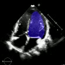
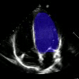
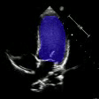

## Heuristic-Boosted Ejection Fraction Estimation from 2D U-Net Segmentation

Ejection fraction estimation from apical 4-chamber echocardiogram videos is achieved through a pipeline combining deep learning segmentation and detailed analysis of ventricular geometry. A ResNet50-encoded 2D U-Net performs frame-by-frame left ventricle segmentation, with ventricular volumes subsequently calculated via the area-length method. To correct systematic biases arising from segmentation errors
and heuristic volume estimation, the pipeline incorporates a regression model that predicts the signed error between estimated and ground truth ejection fractions using geometric descriptors. The most informative predictors include length ratio and volume ratio. This approach achieves a mean absolute error of 4.75% on the EchoNet-Pediatric dataset for apical 4-chamber views, offering an interpretable and refined estimation of cardiac function.

 <table> <tr> <td></td> <td></td> <td></td> </tr> </table> 

[Download paper here](docs/heuristic-boosted-ef.pdf)

### Notebooks
- **Exploratory Data Analysis**: Understand the dataset characteristics and visualize sample frames.  
  [Open in Colab](https://colab.research.google.com/drive/1EQGr7LMHNdov_Vxuk5V9x-JSpUDJwdkm#scrollTo=iowHamIZnI-2)

- **UNet (Baseline)**: 
  Implementation and training of a standard UNet model from scratch.  
  [Open in Colab](https://colab.research.google.com/drive/16NB2oPaZb5Unyc4SEIVSiahU_8pzIMsq#scrollTo=nGZIpARTNMhe)

- **ResNet50-UNet**: A UNet model using a **ResNet50** encoder pretrained on ImageNet, compared for improved segmentation quality.  
  [Open in Colab](https://colab.research.google.com/drive/1YvaR7KLMvMowcxsjpiWhKF3xVVUjL8P9?usp=share_link)

- **Signed Error Learned-Correction**: Inference analysis and machine learning model for signed-error estimation. 
  [Open in Colab](https://colab.research.google.com/drive/1v3UEDoZJckdvhrNXRkg3gbanpcLg_cFu#scrollTo=lOwaDJmuTuB2)